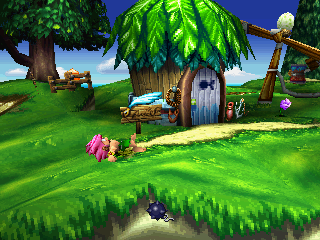
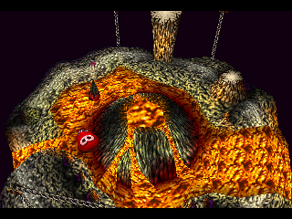
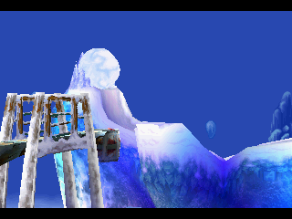
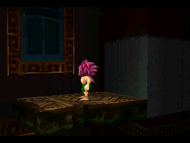
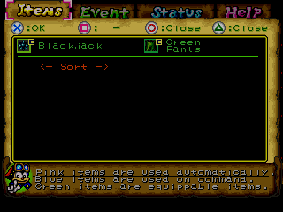
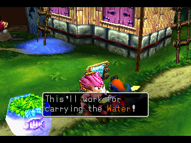

# Tomba Engine — Tomba! and Tomba! 2

This repository contains two isolated PlayStation-to-PC ports:

- **Tomba! 2: The Evil Swine Return** (`SCUS_944.54`) is the active title.
- **Tomba!** (`SCUS_942.36`) follows after Tomba! 2 completes its execution migration.

The intended product is a native/dynarec hybrid. Readable C++ subsystems and native overrides own
deliberately ported behavior; every remaining guest instruction is translated on demand from the
user's authenticated game image by the shared `psxport` Lightrec executor. The gameplay binary contains
no offline-emitted guest source. Lightrec is the default; `psxport` may use its bounded, reason-counted
interpreter fallback only for translation failure or unavailability, unsafe fetch, or a rare unsupported
block. Forced interpreter mode is diagnostic-only, and fallback-covered execution cannot establish
gameplay conformance or performance.

The repository is at the break-first migration gate described in
[`docs/migration.md`](docs/migration.md). Both offline guest-source products and their emission tooling are
already removed and must not be recreated. Tomba! 2 must prove resident and colliding-overlay native
override/original-call dispatch through Lightrec, regain its recorded free-roam frontier, and pass
representative interactive gameplay. Tomba! 1 follows with its recorded 35-field CRT0 and
CD/movie/title frontier.

> You must supply disc images you legally own. No game executable, disc image, or copyrighted game
> asset is included or distributed.

## Product boundaries

The two titles share only the generic PSX framework:

- root `game/` is the Tomba! 2 engine;
- `titles/tomba1/game/` is the separate Tomba! 1 engine;
- `external/psxport/` owns Lightrec integration, PSX hardware/services, runtime image generations,
  native-override dispatch, scoped original calls, invalidation, and independent test infrastructure;
- title code owns executable identity, native game behavior, rendering policy, and enhancements.

Tomba! 2 retains its native scene renderer, true-widescreen target, and interpolated presentation.
Tomba! 1 intentionally targets widescreen only; it must not acquire Tomba! 2's native renderer,
producer, depth, temporal-history, interpolation, or 60fps configuration surfaces.

## Migration checkpoints

For Tomba! 2, the first shipping discriminator uses one resident override and a numeric address reused
by two overlays. Existing binary evidence identifies `0x801113B4` in both A03 and A0B with different
entry shapes. The runtime must select by complete image generation plus address, execute the matching
native owner normally, and execute the correct original guest body through Lightrec for a scoped
original call. A wrong-image negative must prove that neither an override nor a translated block leaks
across the overlay change.

The next checkpoint regains the previously observed title-to-free-roam path with the title-owned frame
transaction and fatal guest-VSync boundary at `0x80085900`. Boot, a logo, or an isolated leaf does not
qualify the migration. Completion requires a bounded representative gameplay scenario covering input,
guest state, timing/interrupts, relevant devices, native reachability, and host performance against
independent evidence. The generated path is already absent, so none of these checks can fall back to it.

Tomba! 1 then reproduces its 35/35 CRT0 boundary through Lightrec and continues across its current
movie/CD frontier. Important preserved facts include public/internal `CdSync` at `0x800648C8` and
`0x80065470`, the fatal guest-VSync call with return address `0x800654A4`, DMA callback registration at
`0x80067E84` for callback `0x80066D80`, and prior progress beyond LBA 58739. Title-screen input and
representative gameplay remain unverified.

## Asset-free verification

`uv run --frozen python tools/verify_ci.py` uses PSXPort's shared consumer verifier
to configure, compile, run all title tests, and inspect the linked execution
boundary. Set `PSXPORT_LIGHTREC_DIR` and `PSXPORT_LIGHTNING_PREFIX` to the exact
maintained dependencies; the workflow records and provisions their revisions.
`--build build/<name>` selects an isolated build whose products live in its own
`bin/` directory. The real-image startup checkpoint now crosses the
[resolved syscall continuation issue](docs/issues/0006-lightrec-function-call-stops-after-supported-syscall.md);
representative gameplay and image-qualified override verification remain open.

## Historical presentation captures

These images record the native Tomba! 2 renderer before the execution migration. They preserve visual
baseline evidence; they are not Lightrec-product verification.

| | |
|---|---|
|  |  |
| Seaside field | Volcanic interior |
|  |  |
| Night sky and parallax backdrop | Boss arena interior |
|  |  |
| Native item-menu producer | In-world dialog box |

## Intended fresh-install contract

Once the migration gate lands, `./run.sh` remains the slim locked launcher. With documented native
dependencies, `uv`, a supported C/C++ compiler, and a user-supplied disc, zero arguments select the
Tomba! 2 native/Lightrec product. `./run.sh tomba1` selects Tomba! 1 after that title reaches its own
gate. Neither launcher path may emit guest source or invoke product tests.

Disc resolution remains explicit argument, title-specific environment/`.env`, then exactly one
repository-root CHD. The selected title validates disc and executable identity before publishing
untracked runtime inputs.

## Documentation map

- [`docs/project-goals.md`](docs/project-goals.md): durable product outcomes
- [`docs/project-state.md`](docs/project-state.md): complete capability state and current focus
- [`docs/migration.md`](docs/migration.md): execution migration order and deletion gates
- [`docs/re-frontier.md`](docs/re-frontier.md): Tomba! 2's ordered ground-truth chain
- [`docs/codemap.md`](docs/codemap.md): subsystem ownership and placement
- [`titles/tomba1/docs/re-frontier.md`](titles/tomba1/docs/re-frontier.md): Tomba! 1's independent chain

Behavioral and address evidence remains in `docs/findings/`, `docs/info/`, and the title-local
equivalents. Retained historical findings are evidence, not an executable source corpus; new analysis
starts from the executable, overlays, and independent runtime observation.
